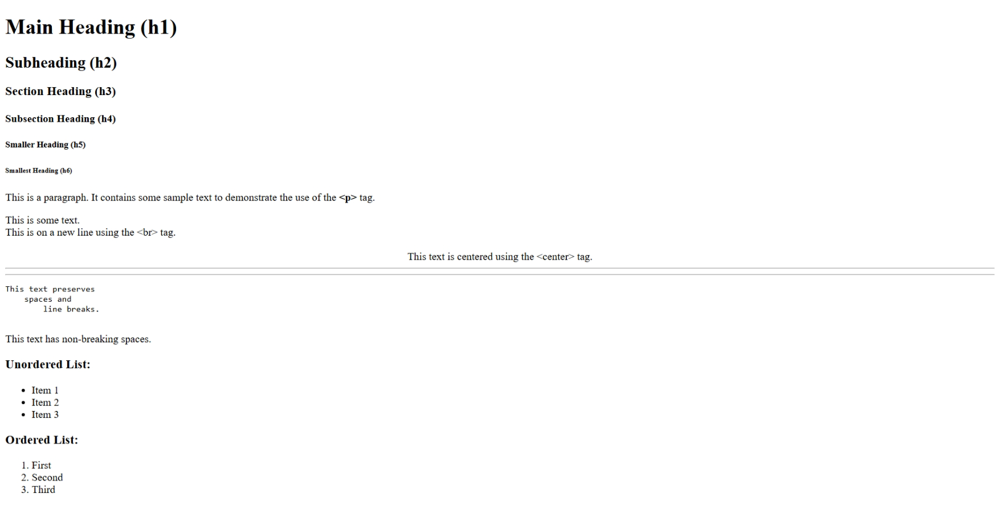

# HTML_CSS



## Features & Documentation
Each feature includes a link to its documentation on [W3Schools](https://www.w3schools.com/html/):

- [Heading tags (`<h1>` to `<h6>`)](https://www.w3schools.com/html/html_headings.asp)
- [Paragraph tag (`<p>`)](https://www.w3schools.com/html/html_paragraphs.asp)
- [Line break tag (`<br>`)](https://www.w3schools.com/html/html_paragraphs.asp#br)
- [Centering text (`<center>`)](https://www.w3schools.com/tags/tag_center.asp) *(deprecated, but still works in many browsers)*
- [Horizontal rules (`<hr>`)](https://www.w3schools.com/tags/tag_hr.asp)
- [Preserving formatting (`<pre>`)](https://www.w3schools.com/tags/tag_pre.asp)
- [Non-breaking spaces (`&nbsp;`)](https://www.w3schools.com/html/html_entities.asp)
- [Unordered lists (`<ul>`) & List items (`<li>`)](https://www.w3schools.com/html/html_lists.asp)
- [Ordered lists (`<ol>`) & List items (`<li>`)](https://www.w3schools.com/html/html_lists.asp)

## Example Code
```html
<!DOCTYPE html>
<html>
<head>
    <title>HTML Basic Tags Example</title>
</head>
<body>

    <!-- Heading Tags -->
    <h1>Main Heading (h1)</h1>
    <h2>Subheading (h2)</h2>
    <h3>Section Heading (h3)</h3>
    <h4>Subsection Heading (h4)</h4>
    <h5>Smaller Heading (h5)</h5>
    <h6>Smallest Heading (h6)</h6>

    <!-- Paragraph Tag -->
    <p>This is a paragraph. It contains some sample text to demonstrate the use of the <b>&lt;p&gt;</b> tag.</p>

    <!-- Line Break Tag -->
    This is some text.<br>This is on a new line using the &lt;br&gt; tag.<br /><br />

    <!-- Center Tag -->
    <center>This text is centered using the &lt;center&gt; tag.</center>

    <!-- Horizontal Rule Tag -->
    <hr>
    <hr />

    <!-- Preserve Formatting Tag -->
    <pre>
This text preserves
    spaces and
        line breaks.
    </pre>

    <!-- Non-breaking Space -->
    This&nbsp;text&nbsp;has&nbsp;non-breaking&nbsp;spaces.

    <!-- Listing Tags -->
    <h3>Unordered List:</h3>
    <ul>
        <li>Item 1</li>
        <li>Item 2</li>
        <li>Item 3</li>
    </ul>

    <h3>Ordered List:</h3>
    <ol>
        <li>First</li>
        <li>Second</li>
        <li>Third</li>
    </ol>

</body>
</html>
